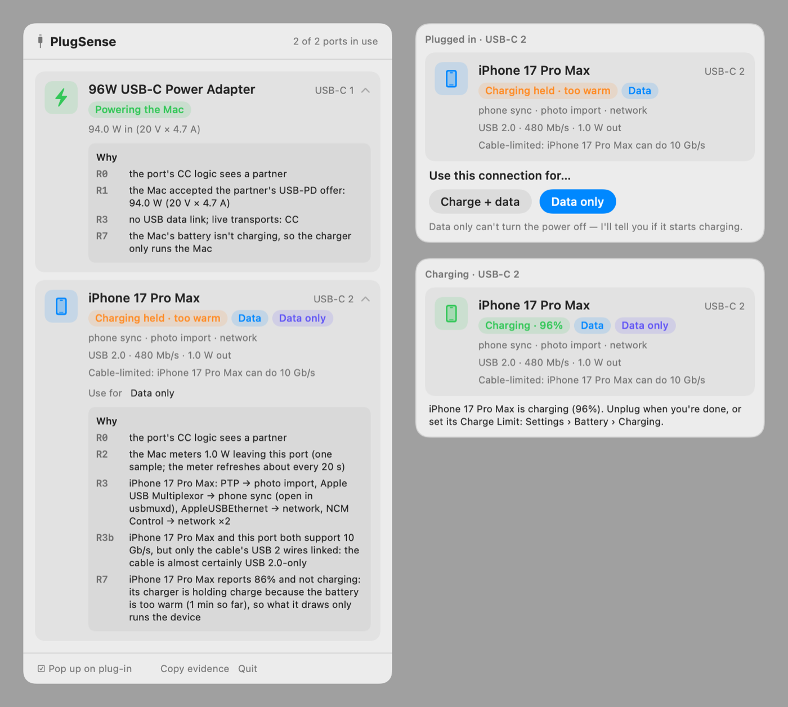

# PlugSense

A macOS menu bar app that tells you what every USB-C port is doing when you plug something in:
charging the Mac, charging your phone, moving data (and what for), driving a display, or holding
data until you approve the accessory. It also shows its reasoning.



## What it tells you

- **Which way power flows, and how much.** "Charging the Mac" at 94 W from a USB-PD charger, or
  1.4 W going out to a phone, as the Mac itself meters it.
- **Whether a phone is really charging.** An iPhone or iPad that trusts your Mac reports its own
  battery, so PlugSense can say *Charging · 63%*, *Full · not charging* or *Charging held · too
  warm*, even while the phone's Battery screen just says "Charging".
- **What the data link is for.** Phone sync, photo import, storage, network, restore/DFU mode,
  debug bridges, keyboards and mice, audio, video, serial.
- **Why a link is slow.** "Cable-limited: iPhone 17 Pro Max can do 10 Gb/s" when a USB 2.0 cable
  is the bottleneck.
- **Charge-only cables and held accessories.** Power with no data link after a few seconds is
  *power only*. Data that macOS holds until you allow the accessory is labelled as held, never
  mistaken for charge-only.
- **Displays and Thunderbolt/USB4 docks.**

Click a port's card to see the rules that fired and the evidence each one used.

## Charge + data, or data only?

When you plug in an iPhone or iPad, PlugSense asks what the connection is for. Be aware that
*Data only* can't stop the phone charging: USB carries data only while the port's 5 V line is live,
the phone decides whether that power goes into its battery, and macOS gives apps no switch for a
port's power. So PlugSense watches the phone's own battery instead and pops up a warning if it
starts charging, pointing you to the phone's Charge Limit (Settings › Battery › Charging). Your
answer is remembered per device model.

## Install

1. Download the latest `PlugSense-<version>.pkg` from [Releases](https://github.com/yasir24s/PlugSense/releases).
   If an older version is installed, quit PlugSense first (Quit in its popover); the installer replaces it.
2. Open it. The installer is signed but not notarized, so macOS refuses it the first time: open
   **System Settings › Privacy & Security**, find the message about PlugSense, and click
   **Open Anyway**.
3. PlugSense.app is installed into /Applications and the `plugsense` command into /usr/local/bin.
   Launch PlugSense from Applications and its icon appears in the menu bar. To start it at login,
   add it under **System Settings › General › Login Items**.

Requires macOS 14 or later. Per-port detail relies on the USB-C port controllers of Apple silicon
Macs (developed on an M2 MacBook Pro). On other Macs, USB devices still appear, under *USB (other)*.

## Privacy

PlugSense runs entirely on your Mac and never touches the network. It needs no permissions: it
reads the I/O Registry and power-source information, and asks iPhones and iPads that already trust
your Mac about their battery through MobileDevice.framework, the framework Finder uses. It never
pairs with a device, and its only diagnostics request is a battery read. The one thing it stores is
your charge-or-data answer per device model, in its own preferences.

## Command line

```bash
plugsense                  # every port, now
plugsense status --why     # with the rules that fired
plugsense watch            # plug, unplug and change events as they happen (--json for NDJSON)
plugsense evidence         # the raw readings the verdicts are made from, as JSON
```

## How it decides

The decision procedure, rules R0–R8 and the signals behind them, is written up in
[PROTOCOL.md](PROTOCOL.md). In short: the port controller says whether something is attached and
which links are live; the USB-C power negotiation and the Mac's per-port power meter say which way
power flows; USB interfaces say what the data is for; and an iPhone's or iPad's own battery says
whether it is charging, and why not.

## Limitations

- PlugSense observes. It can't switch a port's power off, cap it, or block data.
- USB-A ports have no USB-C port controller, so charge-only attachments there are invisible.
- Desktop Macs have no battery controller to meter outgoing power; PlugSense shows the USB power
  allowance instead, labelled as such.
- The iPhone and iPad features use a private Apple framework. If a future macOS changes it,
  PlugSense falls back to what the Mac can see on its own.
- Devices that don't report their own battery (Android phones, game controllers) show *Powered*
  rather than *Charging*: `assessCharge` in `Sources/PlugSenseKit/Charging.swift` doesn't decide
  yet.

## Build from source

Requires Xcode 16 or later.

```bash
swift test                     # the protocol's tests
./scripts/bundle.sh            # dist/PlugSense.app and dist/plugsense, universal
./scripts/package.sh           # dist/PlugSense-<version>.pkg; set SIGN_IDENTITY to sign it
swift scripts/make-icon.swift  # redraws Resources/AppIcon.icns from code
```

`swift run PlugSenseApp` runs the menu bar app unbundled, and `PlugSenseApp --render out.png`
draws its UI from live readings into a PNG.

| Path | What |
|---|---|
| `Sources/PlugSenseKit/` | The protocol: probes, classifier, reasons, watcher, iPhone and iPad reports |
| `Sources/PlugSenseApp/` | The menu bar app: popover, popup, charge-or-data question |
| `Sources/plugsense/` | The command-line tool |
| `Tests/PlugSenseKitTests/` | The classifier's tests |
| `scripts/` | Build, packaging and icon scripts |
| `Resources/AppIcon.icns` | The app icon, drawn by `scripts/make-icon.swift` (no SF Symbols, whose license rules out app icons) |

## License

Copyright © 2026 Yasir-Ali Mahmood. PlugSense is free software, licensed under the GNU General
Public License v3.0; see [LICENSE](LICENSE).
